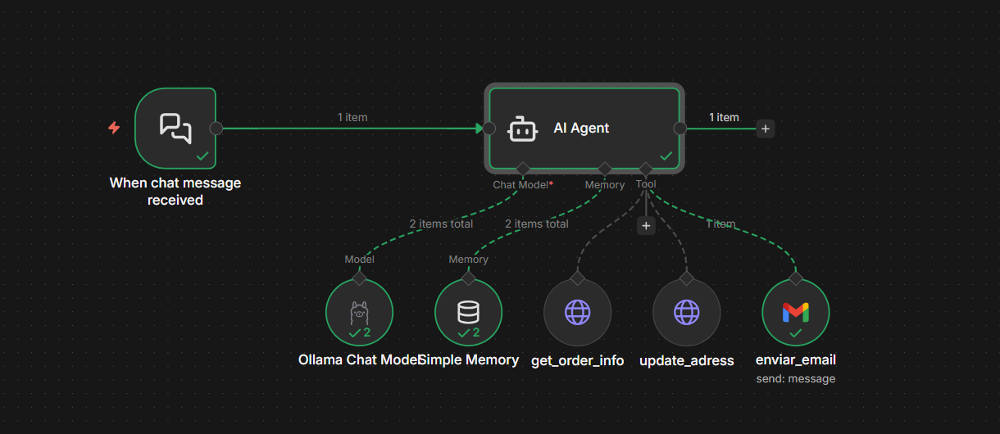

# 🛒 Mi Tienda - API para Testing e Integración con IA

## 📋 Descripción

API REST de una tienda de productos desarrollada con **JSON Server**, diseñada específicamente para realizar pruebas de desarrollo e integración con sistemas de Inteligencia Artificial. Este proyecto proporciona una base de datos simulada que permite testear workflows, automatizaciones y asistentes virtuales sin necesidad de configurar un backend complejo.

## ✨ Características

- 🚀 API REST completamente funcional
- 📦 Base de datos JSON ligera y fácil de modificar
- 🔄 Operaciones CRUD completas (Create, Read, Update, Delete)
- 🤖 Integración con n8n para automatización con IA
- ⚡ Instalación y configuración rápida
- 🛠️ Ideal para desarrollo, pruebas y demos

## 🛠️ Tecnologías

- **JSON Server**: Servidor REST completo basado en archivos JSON
- **Node.js**: Entorno de ejecución
- **n8n**: Plataforma de automatización de workflows

## 📦 Instalación

### Prerrequisitos

- Node.js (versión 14 o superior)
- npm (viene incluido con Node.js)

### Pasos de instalación

1. **Clonar el repositorio**
   ```bash
   git clone <url-del-repositorio>
   cd mi-tienda
   ```

2. **Instalar dependencias**
   ```bash
   npm install
   ```

3. **Iniciar el servidor**
   ```bash
   npm run start
   ```

El servidor se ejecutará por defecto en `http://localhost:3000`

## 🚀 Uso

### Endpoints disponibles

Una vez iniciado el servidor, tendrás acceso a los siguientes endpoints (según tu configuración en `db.json`):

```
GET    /products       # Obtener todos los productos
GET    /products/:id   # Obtener un producto específico
POST   /products       # Crear un nuevo producto
PUT    /products/:id   # Actualizar un producto completo
PATCH  /products/:id   # Actualizar parcialmente un producto
DELETE /products/:id   # Eliminar un producto
```

### Ejemplo de uso

```bash
# Obtener todos los productos
curl http://localhost:3000/products

# Obtener un producto específico
curl http://localhost:3000/products/1

# Crear un nuevo producto
curl -X POST http://localhost:3000/products \
  -H "Content-Type: application/json" \
  -d '{"name":"Nuevo Producto","price":99.99}'
```

## 🤖 Integración con n8n - Asistente de Órdenes

Este proyecto incluye un workflow de n8n que implementa un **asistente inteligente para gestión de órdenes** utilizando IA. El workflow está diseñado para procesar mensajes de chat y realizar operaciones automatizadas sobre la tienda.

### Arquitectura del Workflow



### Componentes del Workflow

El workflow consta de los siguientes nodos:

#### 1. **When chat message received** (Trigger)
- **Función**: Punto de entrada del workflow
- **Descripción**: Se activa cuando un usuario envía un mensaje en el chat
- **Salida**: Mensaje del usuario que será procesado por el agente de IA

#### 2. **AI Agent** (Nodo Principal)
- **Función**: Cerebro del asistente inteligente
- **Modelo**: Ollama Chat Model (modelo v2)
- **Memoria**: Simple Memory para mantener contexto de la conversación
- **Herramientas disponibles**: 
  - `get_order_info`: Consultar información de órdenes
  - `update_address`: Actualizar dirección de envío
  - `enviar_email`: Enviar correos electrónicos

#### 3. **Herramientas (Tools)**

##### 🔍 **get_order_info**
- **Tipo**: HTTP Request (Web)
- **Función**: Consulta información de órdenes desde la API
- **Endpoint**: Se conecta a la API REST de la tienda
- **Uso**: Permite al agente obtener detalles de pedidos

##### 📍 **update_address**
- **Tipo**: HTTP Request (Web)
- **Función**: Actualiza la dirección de envío de una orden
- **Método**: PATCH/PUT
- **Uso**: Permite modificar datos de dirección en tiempo real

##### 📧 **enviar_email**
- **Tipo**: Gmail Integration
- **Función**: Envía correos electrónicos automáticos
- **Uso**: Notificaciones, confirmaciones o alertas al cliente

### Flujo de Funcionamiento

```
1. Usuario envía mensaje → Chat Trigger
                            ↓
2. Mensaje procesado → AI Agent (Ollama)
                            ↓
3. AI Agent analiza intención y decide qué herramienta usar
                            ↓
4. Ejecuta herramienta(s) necesaria(s):
   - Consulta órdenes (get_order_info)
   - Actualiza dirección (update_address)
   - Envía email (enviar_email)
                            ↓
5. AI Agent genera respuesta contextual
                            ↓
6. Respuesta enviada al usuario
```

### Casos de Uso del Asistente

- ✅ **Consulta de estado de pedidos**: "¿Cuál es el estado de mi orden #123?"
- ✅ **Actualización de dirección**: "Necesito cambiar la dirección de envío"
- ✅ **Notificaciones automáticas**: Envío de confirmaciones por email
- ✅ **Soporte conversacional**: Respuestas en lenguaje natural
- ✅ **Gestión multi-tarea**: Puede combinar varias herramientas en una sola conversación

### Configuración del Workflow en n8n

1. **Importar el workflow**
   - Abre n8n
   - Ve a `Workflows` → `Import from File`
   - Selecciona el archivo del workflow (si está disponible)

2. **Configurar credenciales**
   - **Ollama**: Configura la URL del servidor Ollama
   - **Gmail**: Conecta tu cuenta de Gmail para envío de emails
   - **API**: Asegúrate que apunte a `http://localhost:3000`

3. **Activar el workflow**
   - Haz clic en el toggle de activación
   - El workflow estará listo para recibir mensajes

## 📂 Estructura del Proyecto

```
mi-tienda/
├── node_modules/          # Dependencias del proyecto
├── db.json               # Base de datos JSON
├── db-back.json          # Respaldo de la base de datos
├── package.json          # Configuración del proyecto
├── package-lock.json     # Lock de dependencias
├── README.md             # Este archivo
├── mi-tienda-instrucciones.md  # Instrucciones adicionales
├── imagen-flujo-n8n.png        # Diagrama del workflow
└── imagen-conversacion-chatbot.png  # Ejemplo de conversación
``

---

⭐ Si este proyecto te fue útil, considera darle una estrella en GitHub